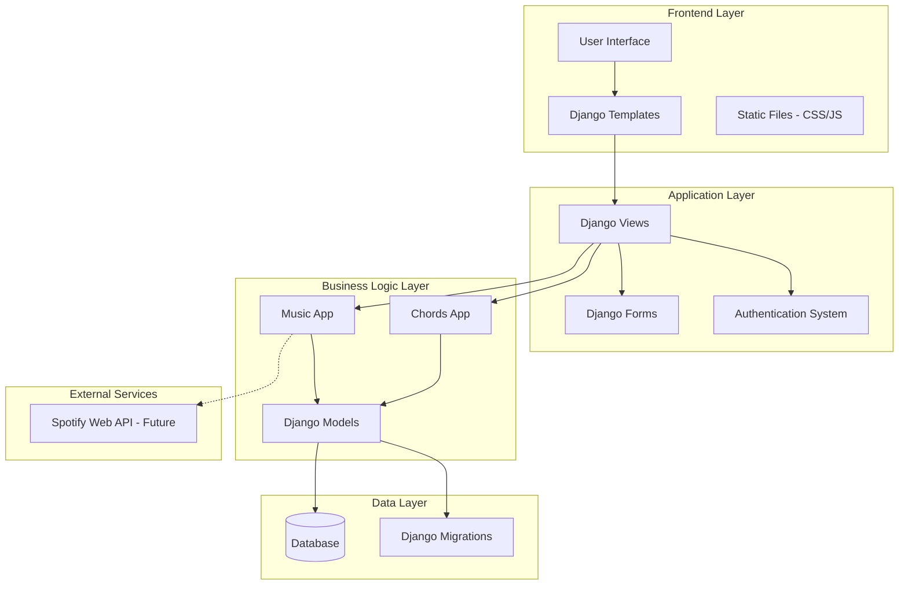
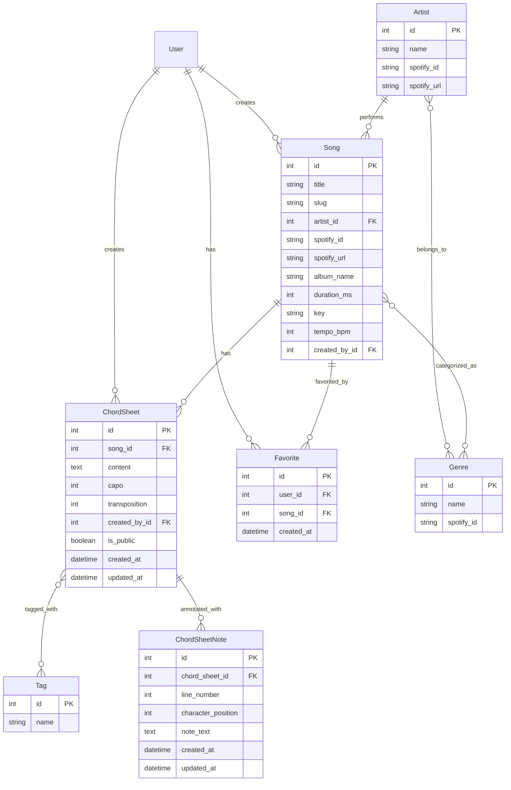

# Design Document

## Overview

chordsheetz is a Django web application built using the Model-View-Template (MVT) pattern. The application provides a platform for musicians to browse songs, create and share chord sheets, and manage their musical content. The design emphasizes clean separation of concerns, scalability, and future integration with Spotify's Web API.

The application follows Django best practices with two main apps: `music` for managing static catalog data and `chords` for user-generated content. The architecture supports both authenticated and anonymous users, with role-based permissions for content creation and management.

## Architecture

### High-Level Architecture



### Application Structure

The project follows Django's standard structure with these key components:

- **config/**: Project configuration (settings, URLs, WSGI/ASGI)
- **music/**: Handles artists, songs, genres, and Spotify integration
- **chords/**: Manages chord sheets, tags, favorites, and user permissions
- **templates/**: HTML templates with responsive design
- **static/**: CSS, JavaScript, and image assets

### Technology Stack

- **Backend**: Django 5.2+ with Python
- **Database**: SQLite (development), PostgreSQL (production via Heroku)
- **Frontend**: HTML5, CSS3, JavaScript (vanilla), Tailwind CSS for responsive design with custom purple theme
- **Authentication**: Django's built-in authentication system
- **Deployment**: Heroku with WhiteNoise for static files
- **Future Integration**: Spotify Web API

## Components and Interfaces

### Music App Components

#### Models

- **Genre**: Manages musical genres with Spotify integration preparation
- **Artist**: Stores artist information with many-to-many relationship to genres
- **Song**: Central model linking artists, genres, and chord sheets

#### Views

- **SongListView**: Paginated song browsing with search and filtering
- **SongDetailView**: Individual song display with associated chord sheets
- **ArtistDetailView**: Artist profile with their songs and genres
- **GenreListView**: Browse songs by genre

#### Services

- **SpotifyService**: Future integration point for Spotify Web API
- **SearchService**: Handles song/artist search functionality

### Chords App Components

#### Models

- **ChordSheet**: User-generated chord content with permissions
- **Tag**: Flexible tagging system for chord sheets
- **Favorite**: User favorites tracking

#### Views

- **ChordSheetListView**: Display chord sheets for a specific song
- **ChordSheetDetailView**: Individual chord sheet display with formatting and note annotations
- **ChordSheetCreateView**: Form-based chord sheet creation with note support
- **ChordSheetUpdateView**: Edit existing chord sheets (owner only) with note management
- **ChordSheetDeleteView**: Remove chord sheets (owner only)
- **ChordSheetNoteCreateView**: Add notes to specific positions in chord sheets
- **ChordSheetNoteUpdateView**: Edit existing notes (chord sheet owner only)
- **ChordSheetNoteDeleteView**: Remove notes (chord sheet owner only)

#### Services

- **TranspositionService**: Handle chord transposition logic
- **ChordFormattingService**: Format chord sheets for display with note annotations
- **PermissionService**: Manage public/private chord sheet access
- **NoteAnnotationService**: Handle note positioning, validation, and rendering

### Authentication and Authorization

#### User Management

- Utilizes Django's default User model (`settings.AUTH_USER_MODEL`)
- Registration and login forms with validation
- Session-based authentication
- Password reset functionality

#### Permission System

- **Anonymous Users**: Can browse songs and view public chord sheets
- **Authenticated Users**: Can create, edit, and delete their own chord sheets
- **Chord Sheet Owners**: Full CRUD access to their content
- **Future Admin Role**: Content moderation capabilities

## Data Models

### Music App Models

```python
# Genre Model
class Genre(models.Model):
    name = models.CharField(max_length=100, unique=True)
    spotify_id = models.CharField(max_length=50, blank=True, null=True)

# Artist Model
class Artist(models.Model):
    name = models.CharField(max_length=200)
    spotify_id = models.CharField(max_length=50, blank=True, null=True)
    spotify_url = models.URLField(blank=True, null=True)
    genres = models.ManyToManyField(Genre, blank=True)

# Song Model
class Song(models.Model):
    title = models.CharField(max_length=200)
    artist = models.ForeignKey(Artist, on_delete=models.CASCADE)
    spotify_id = models.CharField(max_length=50, blank=True, null=True)
    spotify_url = models.URLField(blank=True, null=True)
    album_name = models.CharField(max_length=200, blank=True, null=True)
    duration_ms = models.IntegerField(blank=True, null=True)
    key = models.CharField(max_length=10, blank=True, null=True)
    tempo_bpm = models.IntegerField(blank=True, null=True)
    created_by = models.ForeignKey(User, on_delete=models.CASCADE)
    genres = models.ManyToManyField(Genre, blank=True)
    slug = models.SlugField(unique=True)
```

### Chords App Models

```python
# ChordSheet Model
class ChordSheet(models.Model):
    song = models.ForeignKey('music.Song', on_delete=models.CASCADE)
    content = models.TextField()
    capo = models.IntegerField(default=0)
    transposition = models.IntegerField(default=0)
    created_by = models.ForeignKey(User, on_delete=models.CASCADE)
    is_public = models.BooleanField(default=True)
    created_at = models.DateTimeField(auto_now_add=True)
    updated_at = models.DateTimeField(auto_now=True)
    tags = models.ManyToManyField('Tag', blank=True)

# ChordSheetNote Model
class ChordSheetNote(models.Model):
    chord_sheet = models.ForeignKey(ChordSheet, on_delete=models.CASCADE, related_name='notes')
    line_number = models.IntegerField()
    character_position = models.IntegerField()
    note_text = models.TextField(max_length=500)
    created_at = models.DateTimeField(auto_now_add=True)
    updated_at = models.DateTimeField(auto_now=True)

    class Meta:
        unique_together = ('chord_sheet', 'line_number', 'character_position')
        ordering = ['line_number', 'character_position']

# Tag Model
class Tag(models.Model):
    name = models.CharField(max_length=50, unique=True)

# Favorite Model
class Favorite(models.Model):
    user = models.ForeignKey(User, on_delete=models.CASCADE)
    song = models.ForeignKey('music.Song', on_delete=models.CASCADE)
    created_at = models.DateTimeField(auto_now_add=True)

    class Meta:
        unique_together = ('user', 'song')
```

### Database Relationships



## URL Structure

### Music App URLs

```python
# music/urls.py
urlpatterns = [
    path('songs/', views.SongListView.as_view(), name='song_list'),
    path('songs/<slug:slug>/', views.SongDetailView.as_view(), name='song_detail'),
    path('artists/', views.ArtistListView.as_view(), name='artist_list'),
    path('artists/<int:pk>/', views.ArtistDetailView.as_view(), name='artist_detail'),
    path('genres/', views.GenreListView.as_view(), name='genre_list'),
    path('genres/<int:pk>/', views.GenreDetailView.as_view(), name='genre_detail'),
]
```

### Chords App URLs

```python
# chords/urls.py
urlpatterns = [
    path('songs/<slug:song_slug>/chords/', views.ChordSheetListView.as_view(), name='chordsheet_list'),
    path('songs/<slug:song_slug>/chords/create/', views.ChordSheetCreateView.as_view(), name='chordsheet_create'),
    path('songs/<slug:song_slug>/chords/<int:pk>/', views.ChordSheetDetailView.as_view(), name='chordsheet_detail'),
    path('songs/<slug:song_slug>/chords/<int:pk>/edit/', views.ChordSheetUpdateView.as_view(), name='chordsheet_edit'),
    path('songs/<slug:song_slug>/chords/<int:pk>/delete/', views.ChordSheetDeleteView.as_view(), name='chordsheet_delete'),
    path('songs/<slug:song_slug>/chords/<int:pk>/notes/create/', views.ChordSheetNoteCreateView.as_view(), name='chordsheet_note_create'),
    path('songs/<slug:song_slug>/chords/<int:pk>/notes/<int:note_pk>/edit/', views.ChordSheetNoteUpdateView.as_view(), name='chordsheet_note_edit'),
    path('songs/<slug:song_slug>/chords/<int:pk>/notes/<int:note_pk>/delete/', views.ChordSheetNoteDeleteView.as_view(), name='chordsheet_note_delete'),
    path('tags/', views.TagListView.as_view(), name='tag_list'),
    path('tags/<int:pk>/', views.TagDetailView.as_view(), name='tag_detail'),
]
```

### Authentication URLs

```python
# config/urls.py includes
urlpatterns = [
    path('accounts/', include('django.contrib.auth.urls')),
    path('accounts/register/', views.RegisterView.as_view(), name='register'),
    path('profile/', views.ProfileView.as_view(), name='profile'),
]
```

## User Interface Design

### Responsive Layout Strategy

- **Mobile-first approach** using CSS Grid and Flexbox
- **Tailwind CSS integration** for utility-first styling and consistent components
- **Custom color theme**: Purple as primary color (various shades from light to dark) with amber/yellow as complementary secondary color
- **Breakpoints**: Mobile (320px+), Tablet (768px+), Desktop (1024px+)
- **Touch-friendly** controls for mobile chord sheet interaction

### Key UI Components

#### Navigation

- **Header**: Logo, main navigation, user authentication status
- **Breadcrumbs**: Clear navigation path for nested content
- **Search bar**: Prominent song/artist search functionality

#### Song Browsing

- **Card-based layout** for song listings with artist, genre tags
- **Filtering sidebar** for genres, artists, and tags
- **Pagination** for large result sets

#### Chord Sheet Display

- **Monospace formatting** for proper chord alignment
- **Transposition controls** for key changes
- **Capo indicator** clearly displayed
- **Tag display** as clickable badges
- **Note annotations** displayed as clickable indicators (asterisks, numbers, or icons)
- **Note tooltips/popups** showing annotation content on hover or click
- **Note editing interface** for chord sheet owners to add/edit/delete notes

#### Forms

- **Progressive enhancement** with JavaScript validation
- **Clear error messaging** with field-specific feedback
- **Accessible form labels** and ARIA attributes

### Color Theme and Accessibility Features

- **Primary color palette**: Various shades of purple (from light lavender to deep violet)
- **Secondary color palette**: Amber/yellow tones for accents and complementary elements
- **Semantic HTML5** structure throughout
- **ARIA labels** for interactive elements
- **Keyboard navigation** support
- **High contrast** ratios maintained within the purple/amber color scheme
- **Screen reader** compatibility

## Error Handling

### Application-Level Error Handling

#### Model Validation

- **Field validation** using Django's built-in validators
- **Custom validators** for chord sheet content format
- **Cross-field validation** for transposition and capo logic

#### View-Level Error Handling

- **Permission denied (403)** for unauthorized access attempts
- **Not found (404)** for missing songs/chord sheets
- **Form validation errors** with user-friendly messages
- **Database constraint violations** handled gracefully

#### User Experience Error Handling

- **Inline form validation** with JavaScript
- **Success/error messages** using Django's messages framework
- **Graceful degradation** when JavaScript is disabled
- **Retry mechanisms** for failed operations

### Error Logging and Monitoring

- **Django logging** configuration for production debugging
- **User action logging** for security and analytics
- **Performance monitoring** for slow queries
- **Error aggregation** for production issue tracking

## Testing Strategy

### Unit Testing

- **Model tests** for data validation and relationships
- **View tests** for HTTP responses and permissions
- **Form tests** for validation logic
- **Service tests** for business logic components

### Integration Testing

- **User workflow tests** covering complete user journeys
- **Authentication flow tests** for login/registration
- **CRUD operation tests** for chord sheet management
- **Search functionality tests** across models

### Frontend Testing

- **JavaScript unit tests** for client-side validation
- **Responsive design tests** across device sizes
- **Accessibility tests** using automated tools
- **Cross-browser compatibility** testing

### Performance Testing

- **Database query optimization** testing
- **Page load time** benchmarking
- **Concurrent user** load testing
- **Static file delivery** performance

### Test Data Management

- **Fixtures** for consistent test data
- **Factory classes** for dynamic test object creation
- **Test database** isolation and cleanup
- **Mock services** for external API testing

## Security Considerations

### Authentication Security

- **Password strength** validation
- **Session security** with appropriate timeouts
- **CSRF protection** on all forms
- **Secure cookie** configuration

### Authorization Security

- **Permission decorators** on sensitive views
- **Object-level permissions** for chord sheet access
- **Input sanitization** for user-generated content
- **SQL injection prevention** through ORM usage

### Data Protection

- **Environment variables** for sensitive configuration
- **Database connection** security
- **Static file** security headers
- **User data** privacy compliance

## Performance Optimization

### Database Optimization

- **Query optimization** using select_related and prefetch_related
- **Database indexing** on frequently queried fields
- **Connection pooling** for production deployment
- **Query monitoring** and slow query identification

### Caching Strategy

- **Template fragment caching** for expensive operations
- **Database query caching** for repeated lookups
- **Static file caching** with appropriate headers
- **CDN integration** for static asset delivery

### Frontend Optimization

- **CSS/JavaScript minification** and compression
- **Image optimization** and responsive images
- **Lazy loading** for chord sheet content
- **Progressive enhancement** for better perceived performance

## Future Integration Points

### Spotify Web API Integration

- **OAuth 2.0** authentication flow
- **Artist/Song metadata** synchronization
- **Playlist integration** for chord sheet collections
- **Audio preview** embedding

### Additional Features

- **PDF export** for chord sheets
- **Collaborative editing** capabilities
- **Version control** for chord sheet revisions
- **Mobile app** API endpoints

### Scalability Considerations

- **Microservices** architecture preparation
- **API-first** design for future integrations
- **Database sharding** strategies
- **Horizontal scaling** capabilities
