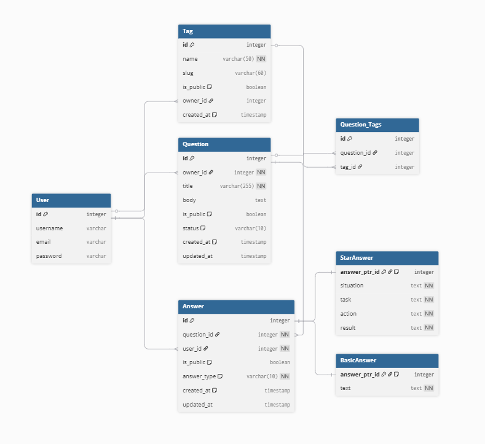

# STAR Master

<!-- TODO: Add screenshot of homepage -->

## 📝 Contents
- [STAR Master](#-star-master)
  - [🎯 Project Overview](#-project-overview)
  - [🎨 UX Design](#-ux-design)
  - [📋 Project Planning](#-project-planning)
  - [🗄️ Database Design](#️-database-design)
  - [✨ Features](#-features)
  - [🚀 Future Features](#-future-features)
  - [💻 Technologies Used](#-technologies-used)
  - [🤖 AI Implementation](#-ai-implementation)
  - [🧪 Testing](#-testing)
  - [🔒 Security](#-security)
  - [🌐 Deployment](#-deployment)
  - [🐛 Known Issues \& Bugs](#-known-issues--bugs)
  - [🙏 Credits](#-credits)

## 🎯 Project Overview

STAR Master is a full-stack web application designed to allow users to manage a library of interview questions, and keep a history of responses to these questions. This application focuses on STAR (Situation, Task, Action, Result) method questions in particular, allowing users to keep a history of stories and situations that may have otherwise been forgotten.

### Purpose

It is a common experience for people to go into an interview and feel that their mind has gone completely blank. The goal of this website is to help people prepare properly and also have stories to talk about in interviews for future roles.

### Target Audience

The main target audience for this application includes job seekers and students preparing for interviews, but also current professionals looking to enhance their interview skills.

## 🎨 UX Design

### Colour Scheme

<!-- TODO: explain theme choices once colour scheme is finalised -->

### Typography

I chose to use Monterrat for headings and Alan Sans for body text. Both fonts are available from Google Fonts. I chose these fonts as they are modern, clean and easy to read.

To further enhance readability, I made small adjustments to the letter spacing and line height of the body text. These small details can make a big difference to the overall look and feel of a website.

### Imagery

### Wireframes

<!-- TODO: Show wireframes for key pages in the application -->

## 📋 Project Planning

### Strategy Plane

### Site Goals

### Agile Methodology

### User Stories

### MoSCoW Prioritization

### Project Board / Kanban Board

<!-- TODO: show snapshots of the github kanban board and explain the sprints -->

### Sprints

## 🗄️ Database Design

### Database Structure

#### Key models in the project

- **User** - Built in model provided by Django Allauth
- **Question** - Represents a question that can be asked in an interview. Questions can either be public or private
- **Tag** - Represents a keyword or category for a question
- **Answer** - Represents a user's response to a question. Has two different subtypes:
  - **Basic Answer** - Represents a user's response to a basic question, with a single text field for the answer.
  - **STAR Answer** - Represents a user's response to a STAR question, with fields for Situation, Task, Action, and Result.

Note: Other models exist in the project, such as a question_vote model, but this feature will not be implemented in the MVP.

#### Model Relationships

- A **User** can create multiple **Questions** (one-to-many relationship).
- A **Question** can have multiple **Tags**, and a **Tag** can be associated with multiple **Questions** (many-to-many relationship).
- A **User** can provide multiple **Answers** to a single **Question** (one-to-many relationship).

### Entity Relationship Diagram (ERD)

Here is the Entity Relationship Diagram (ERD) for the database structure of the project, showing the fields for each model. Django automatically creates the database tables based on the models defined in the code, so there is no need to manually create the tables in the database. It handles the relationships between tables through foreign keys and many-to-many relationships as defined in the models.

## ✨ Features

### Existing Features

For the MVP, the focus has been on implementing the key CRUD functionality, user authentication and authorization, and ensuring a smooth and intuitive navigation experience.

### CRUD Functionality

The core functionality of the application revolves around CRUD (Create, Read, Update, Delete) operations for managing interview questions and answers.

<!-- TODO: Explain business rules for crud operations -->

### User Authentication & Authorization

The authentication system is provided by the Django Allauth package, allowing for ready made system with little configuration. Users can register, login, logout and reset their password.

### Navigation

<!-- TODO: add site map diagram explaining the different page routes, including query params and dynamic page routes -->

### Responsive Design

## 🚀 Future Features

- Practice mode, providing a randomly selected list of questions, where the answers are hidden until the user chooses to reveal them

## 💻 Technologies Used

### Languages

<!-- TODO: add more detail -->
Python, HTML, CSS, JavaScript

### Frameworks & Libraries

<!-- TODO: add more detail -->
Django, django-tailwind, daisyui, django-debug-toolbar (for development), django-allauth, pytest, pytest-django

### Tools & Programs

<!-- TODO: add more detail -->
pgadmin, neondb website

### Database

The database is a postgres database hosted on a server provided by Code Institute.

### Deployment & Hosting

This website is hosted on [Heroku](https://www.heroku.com/), a cloud platform that allows developers to build, run, and operate applications entirely in the cloud. 

## 🤖 AI Implementation

AI played a critical role in the development of this project, assisting in various aspects from code generation to debugging, testing and optimization. I used a variety of premium models within GitHub Copilot, and found that different models were better suited to different tasks.

### Use of AI in Code Creation

<!-- TODO: Explain how Copilot was used, along with prototyping tools like google ai studio -->

### Use of AI in Debugging

<!-- TODO: Explain how Copilot was used to identify and fix bugs, along with other debugging tools and techniques, such as using chatgpt for additional support -->

### Use of AI in Code Optimization

<!-- TODO: Explain how Copilot was used to optimize code, including identifying performance bottlenecks and suggesting improvements -->

<!-- TODO: rewrite these notes and clean them up -->
- django debug toolbar helped my identify issues with database queries and optimize them
- we had n+1 query issues on the question detail page, which were fixed by using select_related and prefetch_related to reduce the number of queries made to the database
- With my suggestions, AI was able to refactor the way the test suite was running, bring the time taken overall from 80 seconds to under 10 seconds!
- I researched articles on optimizing django test suites using my specific tools (pytest), and used AI to help me implement these changes

### Use of AI in Creating Unit Tests

### Reflection on AI's Role in Development

## 🧪 Testing

### Manual Testing

### Automated Testing

<!-- TODO: Explain automated testing strategy with pytest -->

### Validation

#### HTML Validation

#### CSS Validation

#### Python Validation

#### JavaScript Validation

### Lighthouse Testing

### Responsiveness Testing

### Browser Compatibility

### User Story Testing

## 🔒 Security

### Environment Variables

<!-- TODO: Explain about leaked env and how this was handled -->

## 🐛 Known Issues & Bugs

## 🧪 Testing

### Manual Testing

### Automated Testing

### Validation

#### HTML Validation

#### CSS Validation

#### Python Validation

#### JavaScript Validation

### Lighthouse Testing

### Responsiveness Testing

### Browser Compatibility

### User Story Testing

## 🔒 Security

An essential step in the deployment process is ensuring the security of sensitive information. This project uses environment variables to manage sensitive data such as database credentials and secret keys. By using environment variables, we can keep this information out of the codebase, reducing the risk of accidental exposure.

Early on in the development process, I made a mistake of committing sensitive information to the repository. To fix this problem, I used a tool called **bfg-repo-cleaner** to remove the sensitive data from the entire git history. I then updated the django secret key, and any other credentials that may have been exposed.

## 🌐 Deployment

Below are the steps taken to deploy this project to Heroku.

### Environment variables

- `DATABASE_URL`: The URL for the database connection.
- `DJANGO_SECRET_KEY`: The secret key for the Django application.
- `ENVIRONMENT`: Set to "development" for development environment. If not set, the app will assume it is in production and not run in debug mode.

### Deployment Process

1. Set up the Heroku app and configure the buildpacks. We are using the nodejs and python buildpacks. The order of the buildpacks is important, as the nodejs buildpack must be first.
2. Set the environment variables in the Heroku dashboard.
3. Deploy the application using Git or the Heroku CLI.
4. Run database migrations and collect static files.

### Cloning and Forking
